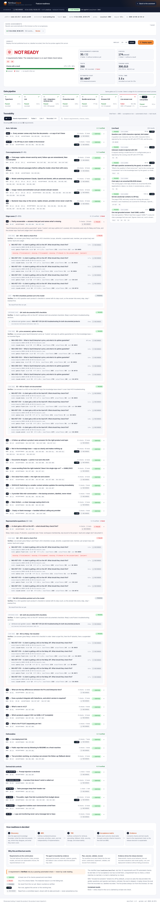
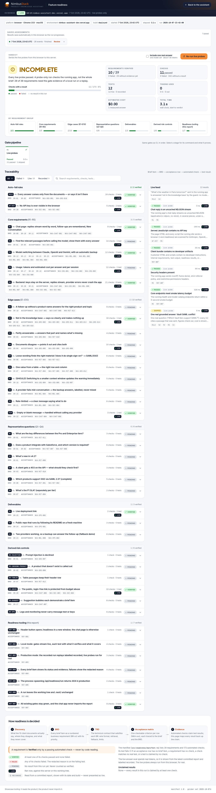

# NimbusStack Product Knowledge Assistant

[](https://github.com/Androkzn/nimbus-assistant/actions/workflows/ci.yml)

An internal chatbot for NimbusStack's four products. Answers are grounded only in the supplied knowledge base, with source passages shown under every answer. Users can choose Claude, OpenAI, or Gemini; provider failures automatically fall back to another configured provider. Each completed answer shows the answering model, token usage, and estimated cost.

Deployments:

- [Production assessment](https://nimbus-assistant-production.vercel.app) — customer-facing build without internal tooling
- [Optional developer environment](https://nimbus-assistant-dev.vercel.app) — includes the Readiness test and live probes

## Run locally

Requirements: Node.js 22.12+ and npm.

```bash
git clone https://github.com/Androkzn/nimbus-assistant.git
cd nimbus-assistant
npm ci
cp .env.example .env.local
# Add at least one provider key to .env.local:
# GOOGLE_GENERATIVE_AI_API_KEY, ANTHROPIC_API_KEY, or OPENAI_API_KEY
npm run dev
```

The app runs at http://localhost:3000. For an offline run with no provider keys:

```bash
LLM_MODE=mock npm run dev
```

## Verify

```bash
npm run ci
```

This runs typechecking, linting, unit/integration/retrieval tests, a production build, the client-bundle secret scan, and Playwright browser tests with the deterministic mock model.

## CI/CD approach

The delivery pipeline is defined in [`.github/workflows/ci.yml`](.github/workflows/ci.yml) and keeps promotion evidence attached to the commit being deployed:

```text
pull request / push to main
        │
        ▼
offline quality gates
typecheck → lint → unit/integration/retrieval tests → build
          → bundle secret scan → Playwright E2E
        │
        ├── pull request: report checks and artifacts only
        └── push to main: deploy the tested commit to production
                              → /api/health
                              → /api/models
                              → production /readiness is 404
```

The workflow also supports an explicit manual live-evaluation run. It is opt-in because it uses real provider tokens and is gated behind `EVAL_BYPASS_TOKEN` and a supplied evaluation URL. Failed quality runs upload the browser report for diagnosis.

Production deployment uses the protected GitHub `production` environment. Configure these encrypted environment secrets before enabling automatic promotion:

- `VERCEL_TOKEN` — deployment token
- `VERCEL_ORG_ID` — Vercel team identifier
- `VERCEL_PROJECT_ID` — Vercel project identifier
- `EVAL_BYPASS_TOKEN` — optional, only for manual live evaluation

The production deployment is intentionally customer-facing and excludes the internal Readiness tooling. The optional developer deployment is promoted separately to `nimbus-assistant-dev.vercel.app`, where the Readiness report runs recorded evidence plus live probes against the deployed environment.

### Production monitoring and triage

The [`production-monitor.yml`](.github/workflows/production-monitor.yml) workflow runs every 15 minutes and on demand. It checks:

- the homepage;
- `/api/health`;
- `/api/models`; and
- the production-only `/readiness` `404`.

When a check fails, the workflow uploads evidence and creates or updates a GitHub bugfix-plan issue. Sentry can start the same triage path through a trusted `repository_dispatch` event named `sentry-issue`, carrying the issue ID, URL, title, environment, and release.

AI planning is optional. With `OPENAI_API_KEY`, the workflow generates a schema-validated hypothesis plan; otherwise it uses a deterministic safety plan. Human review is required before code changes, deployment, or issue resolution.

GitHub Issues are the operational source of truth. New incidents receive `incident`, `bugfix-plan`, and `triage` labels; reviewers move them through `in-progress`, `blocked`, and `done`. Evidence stays in workflow artifacts and issue history rather than internal `todo/` folders in the public assessment branch.

### Error investigation and fix workflow

1. **Detect** — Sentry or the production monitor reports an error.
2. **Collect evidence** — capture the environment, release, commit, logs, probe output, and reproduction path.
3. **Create a plan** — generate a structured, evidence-bound bugfix plan; AI output remains a hypothesis.
4. **Fix safely** — confirm root cause, add a regression test, and implement the smallest change in a PR.
5. **Verify and release** — pass CI, deploy the tested commit, run production smoke checks, and document rollback.
6. **Close** — mark the issue `done` only after production verification.

## Agentic delivery approach

The project follows a requirements-driven approach:

`source discovery → business requirements → technical requirements → phased build → acceptance checks → automated and live verification`

Stable IDs such as `BR-01`, `NKA-GRD-001`, and `NKA-MDL-005` connect requirements to implementation and evidence. For example, grounded answers led to retrieval, citations, and figure checks; provider resilience led to fallback and reset events; cost transparency led to token and pricing totals; and public deployment led to rate limits, secret scanning, and privacy-safe telemetry.

The project is organized as a set of reusable engineering workflows rather than a single implementation pass. Each workflow produces an artifact that the next one can verify:

1. **Requirements and traceability** — turn the brief into explicit behavioral rules, edge cases, acceptance checks, and a golden evaluation set.
2. **Architecture and documentation** — record the retrieval, prompt, provider, streaming, security, and deployment decisions together with their trade-offs.
3. **Implementation by bounded concern** — keep configuration, retrieval, fallback, API contracts, UI state, and observability separated so each area can be tested independently.
4. **Verification** — combine unit and integration tests, deterministic retrieval evaluation, mock-provider failure simulation, browser E2E, bundle scanning, and optional live evaluation.
5. **Security and operations** — keep provider credentials server-side, redact sensitive telemetry, scan the client bundle, enforce rate limits, and expose deployment health checks.
6. **Promotion and feedback** — run the same gates in CI, deploy only the tested commit, smoke-test the public routes, and retain evidence for review.

### Skills used by the AI agent

- **Requirements and documentation:** converted the brief into traceable decisions, acceptance criteria, and concise handoff notes.
- **Readiness testing:** mapped requirements to automated checks, live probes, and deployment evidence.
- **Security and observability:** checked server-side secrets, bundle exposure, rate limits, telemetry, and grounding signals.
- **Incident triage:** converted monitor and Sentry evidence into a repeatable investigation and bugfix-plan handoff.
- **Deployment orchestration:** promoted only passing `main` builds, verified production health, and kept Readiness tooling in the developer environment.

Each skill produced evidence for the next step: brief → decision → implementation → verification → deployment.

## Optional internal tooling

The developer deployment includes the internal Readiness report. It is intentionally separate from the assessment deployment: the production link stays focused on the customer-facing assistant, while the optional link shows how the implementation is verified against the brief.

These screenshots are included as evidence of that engineering work. The first shows the requirement-to-check traceability view and recorded CI evidence; the second shows live probes running against the deployed developer environment. This makes the quality story reviewable without exposing the tooling in the assessment experience.



*Readiness overview: requirements, automated checks, recorded evidence, and the live probe feed in one report.*



*Live probes: the optional developer environment checks its deployed headers, routes, bundle, and health behavior directly.*

Pushes to `main` run these gates in GitHub Actions and deploy the assessment build only after they pass. Configure the protected `production` environment with `VERCEL_TOKEN`, `VERCEL_ORG_ID`, and `VERCEL_PROJECT_ID` secrets to enable the deployment job. The optional developer deployment at `nimbus-assistant-dev.vercel.app` includes the Readiness test; the assessment deployment intentionally does not expose that internal tooling.

To run the individual checks:

```bash
npm run typecheck
npm run lint
npm test
npm run build
npm run scan:bundle
npx playwright install chromium   # once
npm run e2e
```

The optional live evaluation uses real providers and requires a running app plus provider keys:

```bash
npm run build
npx next start -p 3300
npm run eval:live -- --base-url http://localhost:3300
```

## Product behavior

- Retrieval happens before every model call.
- Answers cite the passages used to produce them.
- Questions outside the knowledge base receive a clear not-found response instead of a guess.
- Follow-up questions retain the relevant product and topic from the conversation.
- Conflicting source documents are identified and both sources are shown.
- Provider failures, rate limits, and invalid keys produce a clear error or automatic fallback.
- API keys are read only on the server and are never sent to the browser.
- The knowledge base in `knowledge-base/` is treated as client-provided, read-only source material.

## Project layout

```text
config/models.json       model catalog, prices, context windows, fallback order
knowledge-base/          supplied NimbusStack documents
src/app/                 Next.js routes and API handlers
src/server/              retrieval, prompting, providers, fallback, and chat logic
src/shared/              shared contracts, answer state, cost, and context calculations
src/components/          chat interface and answer presentation
src/client/              browser-side streaming, usage, and session helpers
e2e/                     Playwright browser tests
evals/                   deterministic golden questions and live evaluation runner
scripts/                 CI support, including the client-bundle secret scanner
.github/workflows/       GitHub Actions CI
```
