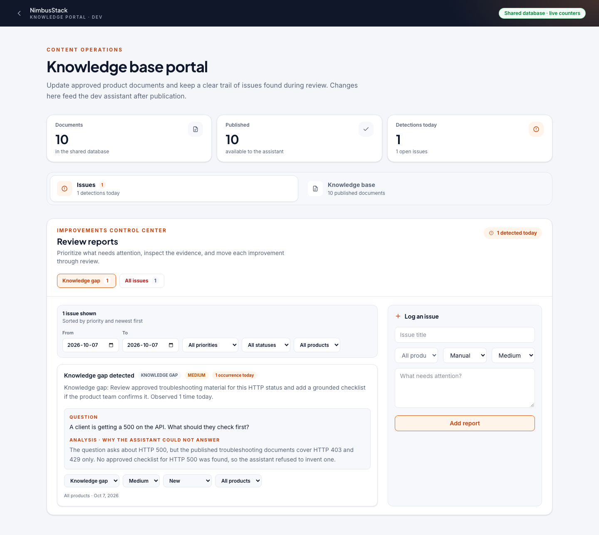
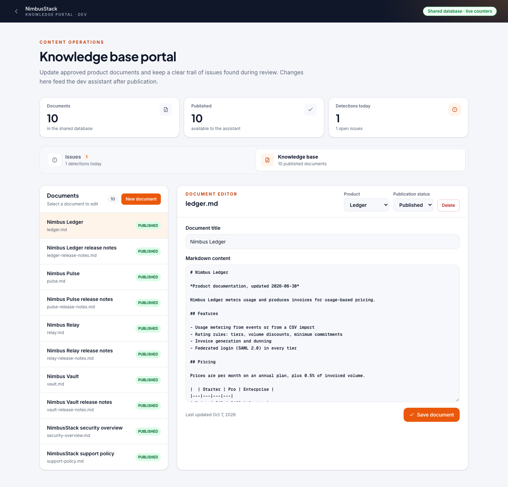
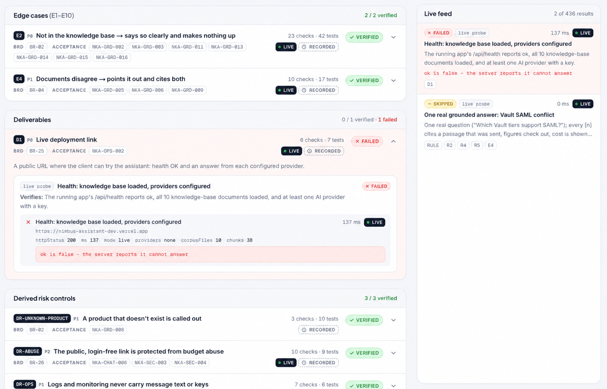

# NimbusStack Product Knowledge Assistant

[](https://github.com/Androkzn/nimbus-assistant/actions/workflows/ci.yml)

NimbusStack Product Knowledge Assistant answers questions about Relay, Vault, Pulse, and Ledger using only the approved NimbusStack knowledge base. Every grounded answer shows its source passages, the model that answered, token usage, and estimated cost.

## Spec-driven approach

The product is built and verified from one traceable delivery flow:

1. **Knowledge-base discovery** defines the approved source material, terminology, conflicts, and deliberate gaps.
2. **Business requirements (BRD)** define the user outcomes and product behavior.
3. **Technical requirements (TRD)** turn those outcomes into implementation, security, and operational contracts.
4. **Implementation planning** sequences the work and names the verification for each phase.
5. **Acceptance rows** convert the requirements into concrete checks.
6. **Code and tests** implement and verify those checks.
7. **Readiness** connects each requirement to its BRD item, acceptance row, automated check, and test evidence.

Every requirement must have an acceptance row, every acceptance row must have a check, and every check must claim a real test. This keeps the assistant, the knowledge-base portal, and the deployment gates aligned with the specification.

## Deployments

- [Production assistant](https://nimbus-assistant-production.vercel.app) — customer-facing assistant
- [Developer portal](https://nimbus-assistant-dev.vercel.app) — assistant, Knowledge base portal, and Readiness report

The production deployment does not expose internal developer tooling. The developer deployment provides `/knowledge-base` and `/readiness`.

## Local development

Requirements: Node.js 22.12+ and npm.

```bash
git clone https://github.com/Androkzn/nimbus-assistant.git
cd nimbus-assistant
npm ci
cp .env.example .env.local
npm run dev
```

Add at least one server-side provider key to `.env.local`:

- `ANTHROPIC_API_KEY`
- `OPENAI_API_KEY`
- `GOOGLE_GENERATIVE_AI_API_KEY`

The application runs at `http://localhost:3000`. To run without provider keys:

```bash
LLM_MODE=mock npm run dev
```

## Quick links

- 🧩 [Spec-driven approach](#spec-driven-approach)
- ⚙️ [CI/CD](#cicd)
- 🧪 [Readiness](#readiness)
- 🗂️ [Knowledge base portal](#knowledge-base-portal)
- 💻 [Local development](#local-development)
- ✅ [Verification](#verification)
- 🧭 [Product behavior](#product-behavior)
- 🔒 [Monitoring and security](#monitoring-and-security)
- 📋 [Requirements and design documents](#requirements-and-design-documents)
- 🧱 [Project layout](#project-layout)

## Product behavior

- Retrieval runs before every model call.
- Answers cite the passages used to produce them.
- Questions without reliable knowledge-base evidence receive a clear not-found response instead of an invented answer. The deterministic guard makes no model call and reports zero tokens and zero cost.
- Unknown products, unsupported pricing tiers, incomplete release versions, undocumented HTTP statuses, and unsupported priorities are guarded instead of being mapped to nearby documented values.
- Follow-up questions retain the relevant product and topic from the conversation.
- Conflicting source documents are identified and both sources are shown.
- Provider failures use a labelled fallback when another configured provider is available.
- User-facing errors use plain recovery guidance; provider and implementation details remain server-side.
- Questions are limited to 2,000 characters and requests contain at most 40 messages. Long browser sessions keep the most recent allowed history.

## Knowledge base portal

The developer portal manages the shared knowledge base and issue reports.

Documents can be created, edited, published, drafted, and deleted. Published documents are retrieved by both deployments after the retrieval cache refreshes.

Deterministic knowledge-base findings are saved with:

- issue type;
- priority;
- status;
- product scope;
- triggering question;
- deterministic analysis;
- proposed action;
- occurrence count for the day.

Repeated observations remain one issue record and increment that issue's occurrence count. Portal counters refresh from the shared API every five seconds and on window focus. Issue records can be filtered by type, priority, status, product, and date range.

### Portal examples





## Readiness

Readiness is the developer verification feature for checking the application against its quality gates and requirement traceability. On the developer deployment, the assistant header includes a Readiness button that opens `/readiness?autostart=1` in a separate window. It is also available during local development and on preview deployments; the production deployment hides the Readiness page and runner endpoint.

### Features

- **Live quality gates:** runs typecheck, lint, unit/integration/retrieval tests, production build, client-bundle scanning, and browser E2E tests.
- **Recorded evidence:** replays the latest published local run with a `recorded` label, including its build and date.
- **Live deployment probes:** checks the running server for health, model availability, chat behavior, bundle exposure, and other public-route guarantees.
- **Traceability:** maps requirements to BRD items, acceptance rows, automated checks, and individual test results.
- **Failure-focused review:** defaults to “Needs improvement” and also supports Failed, Live, Recorded, All, and text search filters.
- **Controlled model usage:** replay and probes do not spend model tokens by default. An optional “Include one real answer” check runs one provider call for live answer evidence.
- **Safe local execution:** readiness builds use `.next-readiness` and port `3199`, leaving the normal `.next/` build untouched; emitted evidence redacts secrets and message content.

### Examples

Run the complete readiness suite locally:

```bash
npm run readiness
```

Run only selected gates:

```bash
npm run readiness -- --stages typecheck,lint,unit
```

Publish the completed local run for the developer portal to replay:

```bash
npm run readiness -- --publish
```

Open the browser report and start it automatically:

```text
http://localhost:3000/readiness?autostart=1
```

For example, a live health probe can return HTTP `200` but still fail if the JSON says `ok: false` or no model providers are available. The report keeps that distinction visible instead of treating the HTTP status alone as success.

### Readiness overview


### Example: failed readiness check

This example shows how Readiness helps developers separate an HTTP transport success from an application readiness failure. The health probe returned HTTP `200` and loaded 10 knowledge-base files, but `providers: none` made `ok: false`; the report connects that evidence to the failed D1 deployment requirement. Developers can see the affected requirement, live probe, and redacted cause together, making the missing provider configuration actionable without searching through logs.



Developers use the report as a delivery gate: start with the failed requirement, open its linked BRD item and acceptance row, inspect the automated check and test evidence, fix the code or deployment configuration, and rerun the gates. Delivery is complete only when every requirement has passing evidence—for this project, `39 / 39` verified—not merely when the code builds.

## Verification

Run the complete local quality suite:

```bash
npm run ci
```

The suite runs typechecking, linting, unit and integration tests, retrieval tests, a production build, client-bundle secret scanning, and Playwright tests with the deterministic mock model.

Individual checks:

```bash
npm run typecheck
npm run lint
npm test
npm run build
npm run scan:bundle
npx playwright install chromium
npm run e2e
```

The optional live answer evaluation uses real provider tokens:

```bash
npm run build
npx next start -p 3300
npm run eval:live -- --base-url http://localhost:3300
```

## CI/CD

The pipeline is defined in [`.github/workflows/ci.yml`](.github/workflows/ci.yml).

- Pull requests run the offline quality gates.
- Pushes to `main` run the quality gates and deploy the tested commit to production.
- Production smoke checks verify `/api/health`, `/api/models`, and that production `/readiness` is unavailable.
- Manual workflow dispatch can run the live answer evaluation against a supplied URL.

Production deployment requires these GitHub environment secrets:

- `VERCEL_TOKEN`
- `VERCEL_ORG_ID`
- `VERCEL_PROJECT_ID`
- `EVAL_BYPASS_TOKEN` for manual live evaluation

## Monitoring and security

The production monitor checks the homepage, health endpoint, model catalog, and production route boundaries. It can collect redacted Sentry and Vercel evidence for a failed deployment check.

Provider keys are read only on the server. Client bundles are scanned for key-shaped values. Logs contain structured request outcomes, retrieval and usage metadata, and grounding-warning counts without storing the full user question or answer. Saved conversations are stored separately in the shared conversations table and are scoped to the anonymous browser owner.

## Requirements and design documents

The requirements package defines the product baseline and its evidence:

- [Knowledge-base discovery](docs/requirements/00_KB_Discovery.md)
- [Business requirements](docs/requirements/01_BRD.md)
- [Technical requirements](docs/requirements/02_TRD.md)
- [Implementation plan](docs/requirements/03_Implementation_Plan.md)
- [Acceptance matrix](docs/requirements/04_Acceptance_Matrix.md)
- [Readiness report](docs/requirements/06_Readiness_Report.md)

## Project layout

```text
config/models.json       model catalog, prices, context windows, fallback order
knowledge-base/          approved NimbusStack Markdown documents
src/app/                 Next.js pages and API routes
src/server/              retrieval, prompting, providers, fallback, storage, and chat
src/shared/              contracts, answer state, cost, context, history, and portal types
src/components/          chat, history, knowledge-base portal, and readiness UI
src/client/              browser streaming, usage, session, and suggestion helpers
e2e/                     Playwright browser tests
evals/                   deterministic golden questions and live evaluation runner
scripts/                 CI, readiness, incident evidence, and bundle scanning tools
.github/workflows/       GitHub Actions workflows
```
